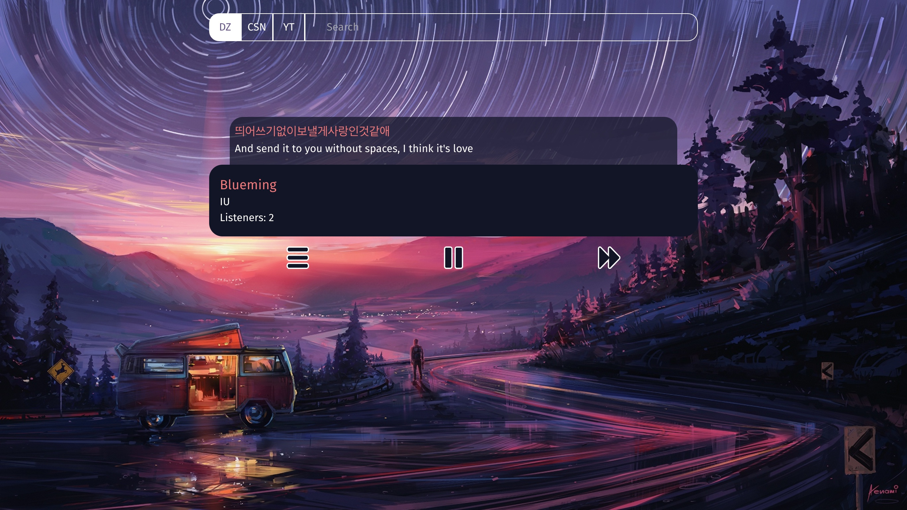
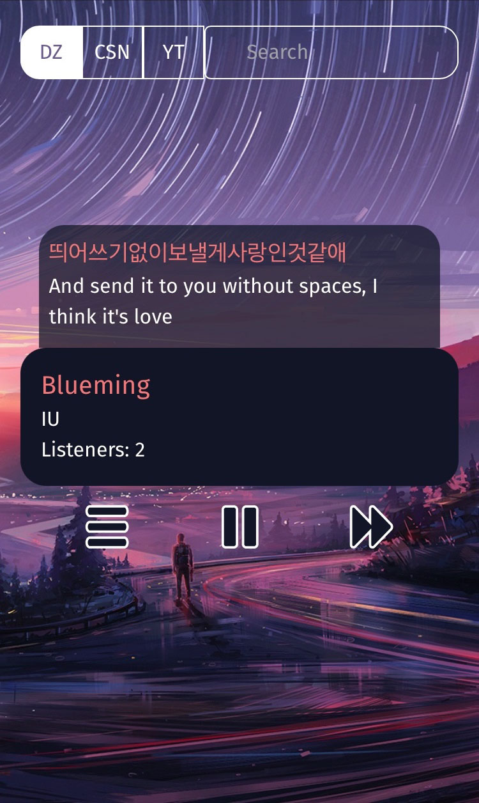

# Music Stream

Listen to music together with your friends from everywhere, at the same time

### Features

- _Synchorized_ music streaming from multiple sources across clients

- _Time-synced_ lyrics with English translation
  - Chromium-based browsers
  - Safari and Firefox

#### Screenshots

These screenshots are taken at different times.

When multiple clients are connected to the same server, they will play the same track at _almost_ identical position.

#### Supported music sources
  - Deezer
  - chiasenhac.vn
  - Youtube

#### Supported lyrics sources
  - MusixMatch
  - Youtube subtitles

### Installation

- Check [INSTALL.md](./docs/INSTALL.md)

### Frontend Deprecation notes
- Our old frontend is deprecated considering how difficult it is to maintain
- v0.7.5 will be the last version that uses the old frontend and compatibility with later server version is not guaranteed
- The new frontend is [ms-kiwi](https://github.com/natsukagami/ms-kiwi)

### License

  This work(MusicStream) is licensed under a [GNU Affero General Public License v3.0](https://www.gnu.org/licenses/agpl-3.0.html).

  The frontend submodule([ms-kiwi](https://github.com/natsukagami/ms-kiwi)) is licensed to [@natsukagami](https://github.com/natsukagami) under a [GNU Affero General Public License v3.0](https://www.gnu.org/licenses/agpl-3.0.html).

